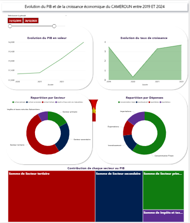

#  Évolution du PIB et de la Croissance Économique du Cameroun (2019–2024)

---

## 🟢 Point de départ

Entre **2019 et 2024**, le Cameroun a connu d’importantes mutations économiques, marquées par des variations de croissance du **Produit Intérieur Brut (PIB)** et des performances contrastées selon les **secteurs d’activités**.  
L’objectif de ce projet est de **rendre ces dynamiques économiques accessibles et compréhensibles** à travers une **analyse visuelle et interactive** basée sur les données officielles de l’**Institut National de la Statistique (INS)**.

---

## ⚙️ Actions menées

- Collecte et exploitation des données issues du rapport officiel de l’**INS** : *Comptes Nationaux du Cameroun 2024*.  
- Nettoyage, transformation et modélisation des données dans **Power BI**.  
- Création de **mesures DAX** pour calculer les indicateurs macroéconomiques clés :  
  - PIB courant et en volume ;  
  - Taux de croissance du PIB réel ;  
  - Contribution sectorielle (primaire, secondaire, tertiaire) ;  
  - Répartition des dépenses et impôts nets de subventions sur produits.  
- Conception d’un **tableau de bord interactif** illustrant :
  - L’évolution du PIB de 2019 à 2024 ;  
  - Le rythme de croissance économique ;  
  - Les contributions des différents secteurs à la croissance nationale.

---

## 📈 Résultats obtenus

- Une **visualisation claire et synthétique** de l’évolution du PIB et de la croissance économique.  
- Mise en évidence de la **prépondérance du secteur tertiaire** dans la structure du PIB.  
- **Amélioration progressive du PIB nominal** sur la période d’analyse.  
- Un **outil interactif et dynamique** facilitant la compréhension de l’économie camerounaise.

---

## 🔵 Point d’arrivée

Ce rapport Power BI illustre la puissance de la **datavisualisation économique** pour le suivi et l’analyse des performances nationales.  
Il constitue une **base de référence** pour :
- Des études macroéconomiques plus poussées ;  
- Des analyses comparatives régionales ;  
- Des travaux académiques ou institutionnels sur la croissance et le développement.

---

## 📚 Source des données

> **Institut National de la Statistique (INS)** — *Comptes Nationaux du Cameroun, Rapport 2024*, Yaoundé, Cameroun.
